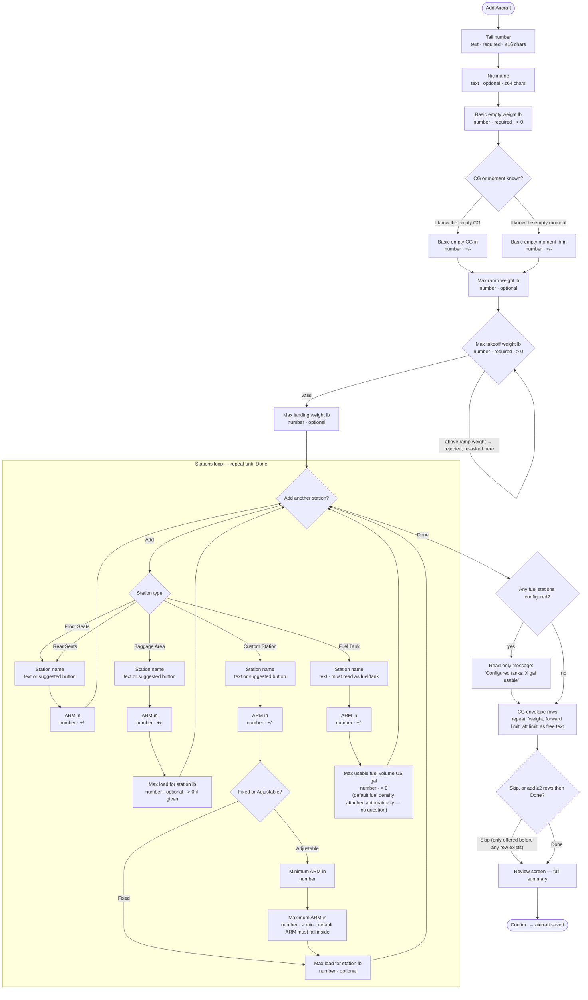
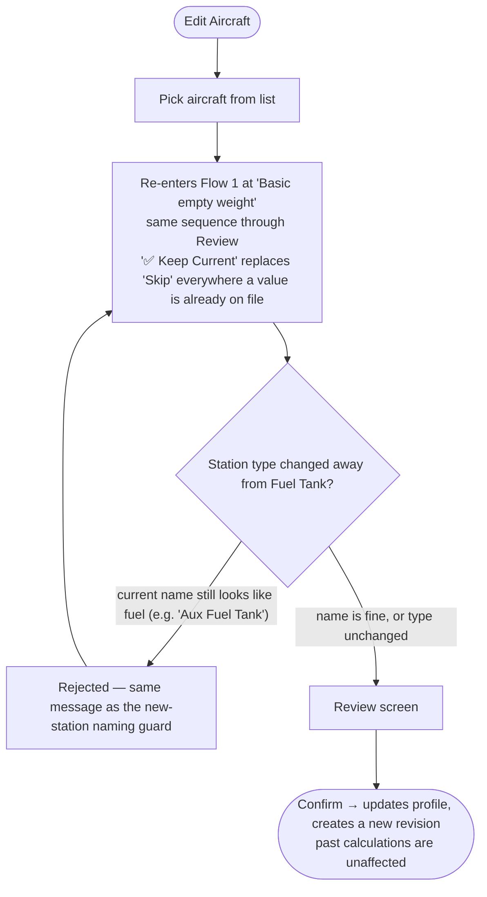
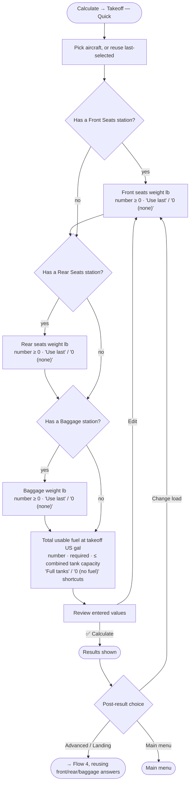
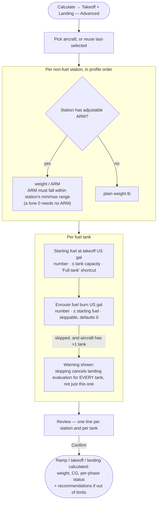

# Bot Question Flow Schemas

This document is a visual schema of every question/step the Telegram bot asks the pilot, one flowchart per flow. Each box names the question, its answer type and validation; each labeled arrow shows which branch a choice takes. Use it to plan changes (add/remove/reword a question, change branching) before touching code.

Source files:
- States: `app/bot/states/aircraft_wizard.py`, `app/bot/states/flight_wizard.py`, `app/bot/states/quick_calc_wizard.py`
- Handlers: `app/bot/handlers/aircraft_wizard.py`, `app/bot/handlers/aircraft_update.py`, `app/bot/handlers/flight_calculation.py`, `app/bot/handlers/quick_calculate.py`, `app/bot/handlers/wizard_nav.py`
- Prompt text: `app/bot/texts/i18n.py`
- Config: `app/config.py` (env-driven `Settings` — see "Configurable values" below)
- Post-calculation recommendation logic (what to change if a result is out of limits) is a separate system, documented in `docs/superpowers/specs/2026-08-04-recommendation-engine-upgrade-design.md` — this document only covers the input *questions*, not that output logic.

**Status: flows described here match the app as implemented on 2026-08-01** (see Changelog at the bottom for the simplification + bug-fix pass that produced this shape). All 122 tests pass (`python -m pytest -q`), including a full end-to-end wizard walkthrough (`tests/test_wizard_end_to_end.py`) that drives the real handlers against a real database.

---

## Design principle

The whole point of this bot: a pilot (owner, friend, or renter) should be able to open it, enter data, and get a mass & balance answer for **this flight, right now** — in about a minute. Every question that isn't strictly needed to produce a correct, safe calculation is a tax on that minute. The identifier for an aircraft is the **tail number**; a **nickname** is a nice-to-have for telling similar rentals apart — nothing else about "who made it" matters to the math.

Rule of thumb: if a field isn't read by the weight-and-balance calculation and isn't the tail number/nickname, it gets cut, defaulted, or moved out of the guided flow entirely — not just made optional. Optional-but-asked still costs a screen and a decision.

**No hardcoded values in application logic.** Hardcoded literals are for tests only. Any default that encodes a business/physical assumption (a fuel density, a tolerance) lives in `app/config.py`'s `Settings` (env-driven via `.env`), not as a Python constant in a handler or service file. Pure math facts (unit conversion factors, numerical-stability epsilons, string-length caps, search-algorithm step sizes) are fine to hardcode — they don't vary by aircraft, fuel, or region.

### Configurable values

| Setting | Default | Used for |
|---|---|---|
| `default_fuel_density_lb_per_gal` | 6.0 (100LL) | Applied automatically to every new fuel station — no longer a per-tank question. |
| `useful_load_tolerance_lb` | 5.0 | Tolerance for the internal useful-load consistency check. |
| `empty_cg_consistency_tolerance_in` | 0.01 | Tolerance for the Basic Empty Weight/Moment/CG consistency check at save time. |
| `min_front_seat_weight_lb` | 170.0 | Not a question — a floor used by the recommendation engine so it never suggests removing the pilot. |

Change these via `.env`, not by editing source.

---

## Shared navigation (all flows)

| Button | Callback | Behavior |
|---|---|---|
| « Back | `wizard:back` | Pop last step from history, re-render it. Not available on step 1 of a flow. |
| ✅ Keep Current | `wizard:keep` | Keep existing value (update mode only, when a value is already on file). |
| Skip | `wizard:skip` | Leave optional field empty. |
| ✖ Cancel | `wizard:cancel` | Abort flow, clear state, return to main menu. Deliberately unscoped to any one wizard's `StateFilter` — `flight_calculation.py`'s keyboards also emit `wizard:cancel` with no handler of their own and rely on this one being reachable from any state. |
| ✅ Confirm | `wizard:confirm` | Commit at the review step (Aircraft Wizard, Full Calculation). |
| ✅ Calculate | `quick:calculate` | Commit at the review step (Quick Calculation) — uses the same checkmark as Confirm for visual consistency. |

Notes:
- Quick Calculation flow has **no Back button at all** — only Cancel, or "Edit" which restarts the flow from the top.
- Full Calculation flow supports Back via a checkpoint stack (since load/fuel steps repeat once per station/tank).
- Aircraft Wizard's station sub-steps (create *and* edit) support Back throughout — type, name, ARM, ARM mode, min/max ARM, max weight all push checkpoints and render with a working Back button. (The one step that used to lack Back — fuel density — no longer exists as a question at all.)
- Quick Calculation's front/rear/baggage/fuel steps each offer a one-tap **"0 (none)" / "0 (no fuel)"** shortcut alongside "Use last", for the common case of an empty seat, no baggage, or dry tanks.

---

## Flow 1 — Fill Up Aircraft Data (new aircraft)

Entry: "Add Aircraft" — goes straight to tail number. There is no setup-mode picker; every question below is asked once, in order.

Notes the diagram compresses:
- **Station name guard:** rejects names containing "fuel"/"tank(s)" unless the station's type is Fuel Tank.
- **Envelope row editing:** once ≥1 row exists, "✏️ Edit a row" and "🗑 Remove a row" both open a picker listing every row so the pilot picks the exact one — Edit re-prompts for that row's three numbers pre-filled as "currently: …" and replaces it in place; Remove deletes it.
- **Tanks recap** is its own message, separate from the CG-envelope prompt, since tank capacity has no mathematical relationship to the CG envelope.
- **Immediate ramp/takeoff validation:** because ramp weight is asked first, a takeoff weight above it is rejected right there (message: "Max ramp weight (X) cannot be below max takeoff weight (Y)"), not silently accepted and caught later at Review.

**What's no longer asked, and why:**
- **Manufacturer / Model** — not used by the calculation, not the identifier. The `manufacturer`/`model` DB columns still exist (nullable, kept for legacy aircraft) but the wizard never writes to them. Aircraft pickers/lists display `"{tail_number} — {nickname}"` (or just the tail number) instead of `"{tail_number} ({model})"`.
- **Fuel density** — was a per-tank question; replaced by the configured default (see Configurable values). Converting a station's type in Edit Aircraft still re-checks that a fuel-sounding name isn't left on a non-fuel station (see Flow 2).
- **Known useful load** — was a pure cross-check convenience with nothing to check once removed as a question; not something the calculation itself needs.
- **Total usable fuel (re-typed)** — was never persisted; replaced by the read-only recap sent when the station loop finishes.
- **Max zero-fuel weight (MZFW)** — only constrains aircraft where wing fuel provides bending relief (twins, turboprops, transport-category); never applied to the light GA singles this app targets, and the calculation engines treated "not set" as a permanent no-op. Removed as a question, a stored field, and a database column (see migration `aef862b833e8`).

---

## Flow 2 — Aircraft Update (existing aircraft)

Entry: "Edit Aircraft" → pick an aircraft from a list.

Notes:
- Tail number and nickname are **not re-asked** — carried over as-is. Legacy manufacturer/model values (if any exist from before this revision) are preserved on the record but not re-asked either.

---

## Flow 3 — Quick Calculation

Entry: "Calculate" → "Takeoff — Quick" → pick aircraft (or auto-use previously selected aircraft).

Only asks about station types that actually exist on the aircraft profile; skips any that don't apply.

Notes:
- **No Back button at all** in this flow — only Cancel, or "Edit" which restarts from the top (fuel is not carried over on Edit; it must be re-entered).
- "Advanced / Landing" reuses the Quick answers because a Quick-eligible profile has at most one station of each type (front/rear/baggage), then jumps straight to Flow 4's per-tank fuel questions.

---

## Flow 4 — Full Calculation ("Takeoff + Landing — Advanced")

Entry: "Calculate" → "Takeoff + Landing — Advanced" → pick aircraft (or auto-use previously selected aircraft).

Notes:
- Back is supported throughout (steps are tracked as a checkpoint stack, since load/fuel steps repeat per station/tank) — unlike Quick Calculation.
- "Recommendations if out of limits" is produced by `app/domain/recommendations.py`, not part of this question flow — see the design spec referenced at the top of this document.

---

## Changelog — 2026-07-31 simplification + bug-fix pass

Applied, verified by the full test suite (120 passing) plus a new full end-to-end wizard walkthrough test:

**Question-set simplification:**
- Removed Manufacturer and Model as questions (DB columns kept, nullable, unused by the wizard).
- Removed the Quick vs. Advanced Setup mode picker entirely — every optional field is now asked once, with Skip, regardless of aircraft type.
- Moved Nickname out of any mode-gating — always asked, right after tail number.
- Removed Fuel Density as a per-tank question — replaced by a configurable default (`settings.default_fuel_density_lb_per_gal`).
- Removed Known Useful Load as a question (was a cross-check with nothing left to check once its input was gone).
- Removed the re-typed "Total usable fuel" question — replaced with a read-only recap of the tanks just configured.
- Trimmed `envelope_prompt` from a 4-sentence paragraph to one instruction + one example line.
- Added one-tap "0" shortcuts to Quick Calculation's front/rear/baggage/fuel steps.

**Bug fixes:**
- Fixed a Critical state-hijack bug: the Quick/Advanced setup-mode callback had no `StateFilter`, so a stale button could corrupt an unrelated in-progress flow. (Moot now that the mode picker is gone, but the underlying missing-`StateFilter` pattern was audited across the whole file — no other callback handler has the same gap.)
- Fixed a station type-change gap: converting a station's type away from Fuel Tank now re-runs the fuel-name guard, rejecting the change if the name would become inconsistent with the new type.
- Fixed inconsistent negative-value handling: entering empty CG directly now allows negative values, matching the already-negative-tolerant empty-moment path.
- Fixed ramp-vs-takeoff weight ordering: now validated immediately when takeoff weight is entered, not deferred to the final Review screen after every remaining question has already been answered.
- Config: `USEFUL_LOAD_TOLERANCE_LB`/`EMPTY_CG_CONSISTENCY_TOLERANCE_IN` hardcoded module constants (one of which duplicated an already-defined-but-unread `Settings` field) replaced with live reads from `app.config.settings`.
- Removed dead `QuickCalcWizard.fuel_exact_split` state.
- Removed dead Russian `'пропустить'` skip-synonym residue from `_common.py` (left over from removed Russian-language support).
- Unified the Quick Calculation "commit" button to `'✅ Calculate'`, matching `'✅ Confirm'` used elsewhere.

**Verification:** migration (`alembic/versions/6f3b1a8c7e2d_make_aircraft_model_nullable.py`) tested upgrade/downgrade against a scratch SQLite database; `pyflakes` clean on all changed files; `python -m pytest -q` → 120 passed, including `tests/test_wizard_end_to_end.py`, which drives the entire Add Aircraft sequence through the real handlers against a real database from "Add Aircraft" to a persisted, correctly-shaped aircraft record.

### Deliberately not addressed in this pass

Flagged in review but left as-is — cosmetic/lower-priority, or a larger design change than the scope of this pass:
- Two different number-formatting conventions still coexist (plain `"2200 lb"` while entering CG-envelope rows vs. comma-separated `"2,200 lb"` on the Review screen).
- Emoji usage on main-menu buttons is still inconsistent (some submenu items have an icon, siblings don't).
- Routine validation failures (name too long, required field empty) still route through the generic "Something went wrong with that input: …" framing rather than a calmer field-specific message.
- Ramp/landing questions are still asked during aircraft setup rather than deferred lazily to the first Full Calculation that needs them — a pilot who only ever runs Quick Calculations answers (and skips) these regardless.

---

## Changelog — 2026-08-01 MZFW removal

Max zero-fuel weight (MZFW) only constrains aircraft where wing fuel provides bending relief
(twins, turboprops, transport-category) — never the light GA singles this app targets. Both
calculation engines treated an unset limit as a permanent no-op, so most aircraft never saw any
effect from the question either way. Removed outright rather than continuing to carry an
always-optional, rarely-applicable field:

- Removed the "Max zero-fuel weight" question from Flow 1 (Fill Up Aircraft Data) and its
  associated skip-on-update exception from Flow 2.
- Removed `max_zero_fuel_weight_lb` from `AircraftProfile`, `AircraftRevisionDraft`, and the
  `aircraft_revisions` database table (migration `aef862b833e8_remove_max_zero_fuel_weight`).
- Removed `zero_fuel_weight_lb` / `zero_fuel_limit_lb` / `zero_fuel_status` from both engines'
  result types (`CalculationResult`, `QuickCalculationResult`) and every place that displayed
  a zero-fuel-weight line or folded a ZFW violation into the overall/phase status.
- Removed the now-dead `profile_limit_mzfw` / `ask_max_zfw` / `overall_reason_zfw` i18n strings.

---

## Changelog — 2026-08-01 CG-envelope UX fixes

Two fixes to the CG-envelope row step (Flow 1, step 9), prompted by a pilot reading the actual
Telegram screen:

- **Tanks recap relocated and relabeled.** "Tanks total: X gal" used to be folded into the
  CG-envelope prompt itself, which wrongly implied the number was somehow part of the CG
  envelope math (it's the sum of each tank's configured usable *capacity*, unrelated to CG). It
  now prints as its own message right when the station loop ends (`_send_tanks_capacity_recap`
  in `aircraft_wizard.py`), and reads "Configured tanks: X gal usable" instead.
- **Added Edit alongside Remove for envelope rows.** Fixing one mistyped number used to mean
  deleting the whole row and re-typing all three (weight, forward, aft). "✏️ Edit a row" now
  opens the same kind of picker "🗑 Remove a row" already used (list every row, pick the exact
  one — never an ambiguous "last" or "first"), then re-prompts for the row's numbers pre-filled
  as a "currently: …" hint and replaces that row in place. New state:
  `AircraftWizard.envelope_edit_row`; new FSM key: `editing_envelope_row_index` (mirrors the
  existing `editing_station_index` pattern used for station editing).

---

## Changelog — 2026-08-01 removed dead fields/flows

Removed several fields and one whole entry point that nothing in the app actually read:

- **Adjustable ARM / station max weight.** Removed `is_adjustable_arm`, `minimum_arm_in`,
  `maximum_arm_in`, `maximum_weight_lb` from stations, the wizard questions that set them, and
  the calculator/recommendation logic that read them. A station's ARM is now always its
  `default_arm_in`; stations are never weight-capped individually (migration `3f9a2c6b1d4e`).
- **"Temporary or Rental Aircraft" menu option.** This was a duplicate entry point into the
  exact same Add Aircraft wizard, differing only by setting `is_temporary=True` on the created
  row. Nothing read that flag anywhere — no listing/display difference, no filtering, no
  auto-archive (the one comment referencing a "future auto-archive pass" was never built). A
  rental aircraft is now just added normally and archived/deleted like any other. Removed the
  menu button, `start_rental_wizard`, and the `is_temporary` column (migration `5a1c8e0f2b3d`).
- **Quick Calculation "Enter exact tank quantities" shortcut.** Removed — the fuel field is
  already free-text, and the shortcut jumped into Full Calculation from scratch, re-asking
  front/rear/baggage weights already entered in Quick.
- **Quick → Advanced carry-over.** Tapping "Advanced/Landing" after a completed Quick
  Calculation now reuses its front/rear/baggage weights (valid because a Quick-eligible profile
  has at most one station of each of those types) instead of re-asking them, and jumps straight
  to the per-tank fuel questions Quick couldn't answer.

---

## Changelog — 2026-08-04 recommendation engine note

No question-flow changes — Flow 4's post-Review recommendations (and Flow 3's, via the
separate Quick recommender) got a backend upgrade: a fuel-safety priority bias, a new
"reduce seat load" suggestion, Rear Seats ↔ Baggage moves, and combined fuel+load
suggestions. See `docs/superpowers/specs/2026-08-04-recommendation-engine-upgrade-design.md`
for the full design — nothing here changed since no question, state, or validation rule was
added, removed, or reworded.

---

## Quick reference: where to make a change

| Want to... | Edit |
|---|---|
| Change question wording | `app/bot/texts/i18n.py` (`STRINGS` dict) |
| Add/remove/reorder a step | `app/bot/states/*.py` (add/remove state) + corresponding handler file's render/handler functions and the "advance" branch functions that decide what comes next |
| Change validation rules | The `got_*` handler for that state in the relevant `app/bot/handlers/*.py` file |
| Change a configurable default (fuel density, tolerances) | `app/config.py` `Settings` fields, or `.env` |
| Change post-calculation recommendation logic | `app/domain/recommendations.py` (Advanced) or `app/domain/quick_recommendations.py` (Quick) — see the recommendation engine design spec |
